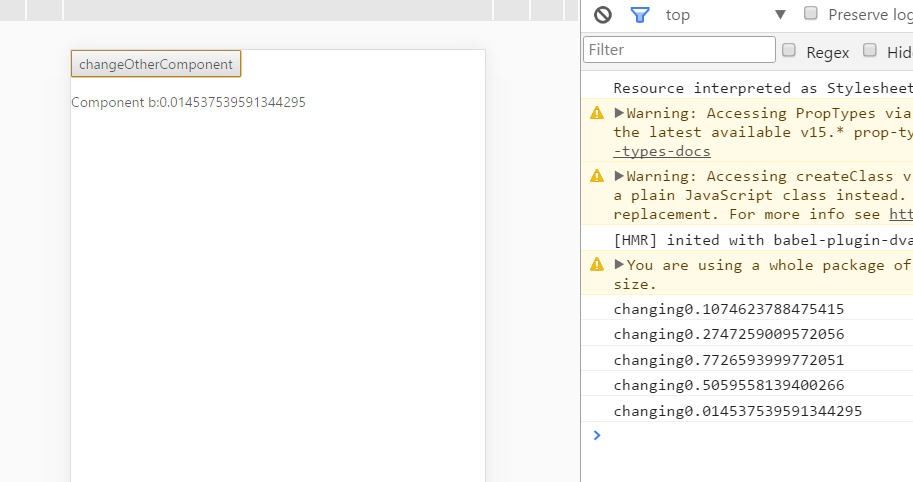

<!DOCTYPE html>
<html>
<head>
  <titie></titie>
</head>
<body>
  react.eval
横向的react组件交互
 
<pre>
 安装 
npm install react.eval --save

ps:
1.4.4之前为测试版本
</pre>
  

  &nbsp;

被调用者
<pre style="font-family:新宋体;font-size:13;color:black;background:white;">import&nbsp;React&nbsp;from&nbsp;&#39;react&#39;;
import&nbsp;{&nbsp;react&nbsp;}&nbsp;from&nbsp;&#39;react.eval&#39;;

class&nbsp;BComponent&nbsp;extends&nbsp;React.Component&nbsp;{
&nbsp;&nbsp;constructor(props)&nbsp;{
&nbsp;&nbsp;&nbsp;&nbsp;super(props);
&nbsp;&nbsp;&nbsp;&nbsp;this.state&nbsp;=&nbsp;{
&nbsp;&nbsp;&nbsp;&nbsp;&nbsp;&nbsp;content&nbsp;:&nbsp;&#39;nothing&#39;
&nbsp;&nbsp;&nbsp;&nbsp;};
&nbsp;&nbsp;&nbsp;&nbsp;//&nbsp;register&nbsp;instance&nbsp;for&nbsp;calling
&nbsp;&nbsp;&nbsp;&nbsp;react.init(this);
&nbsp;&nbsp;}
&nbsp;&nbsp;changeContent&nbsp;=&nbsp;(str)&nbsp;=&gt;&nbsp;{
&nbsp;&nbsp;&nbsp;&nbsp;console.log(&quot;changing&quot;+str);
&nbsp;&nbsp;&nbsp;&nbsp;this.setState({
&nbsp;&nbsp;&nbsp;&nbsp;&nbsp;&nbsp;content:str
&nbsp;&nbsp;&nbsp;&nbsp;});
&nbsp;&nbsp;}
&nbsp;&nbsp;render()&nbsp;{
&nbsp;&nbsp;&nbsp;&nbsp;return&nbsp;&lt;p&gt;
&nbsp;&nbsp;&nbsp;&nbsp;&nbsp;&nbsp;Component&nbsp;{this.id}:
&nbsp;&nbsp;&nbsp;&nbsp;&nbsp;&nbsp;{this.state.content}
&nbsp;&nbsp;&nbsp;&nbsp;&lt;/p&gt;;
&nbsp;&nbsp;}
}
export&nbsp;default&nbsp;BComponent;

</pre>
调用者
<pre style="font-family:新宋体;font-size:13;color:black;background:white;">import&nbsp;React&nbsp;from&nbsp;&#39;react&#39;;
import&nbsp;{&nbsp;react&nbsp;}&nbsp;from&nbsp;&#39;react.eval&#39;;

class&nbsp;AComponent&nbsp;extends&nbsp;React.Component&nbsp;{
&nbsp;&nbsp;constructor(props)&nbsp;{
&nbsp;&nbsp;&nbsp;&nbsp;super(props);
&nbsp;&nbsp;}
&nbsp;&nbsp;render()&nbsp;{
&nbsp;&nbsp;&nbsp;&nbsp;return&nbsp;&lt;p&gt;
&nbsp;&nbsp;&nbsp;&nbsp;&nbsp;&nbsp;&lt;button&nbsp;onClick={()&nbsp;=&gt;&nbsp;{
&nbsp;&nbsp;&nbsp;&nbsp;&nbsp;&nbsp;&nbsp;&nbsp;//&nbsp;id&nbsp;.&nbsp;methodName&nbsp;,arguments
&nbsp;&nbsp;&nbsp;&nbsp;&nbsp;&nbsp;&nbsp;&nbsp;react.eval(&#39;b.changeContent&#39;,&nbsp;Math.random());
&nbsp;&nbsp;&nbsp;&nbsp;&nbsp;&nbsp;}}&gt;changeOtherComponent&lt;/button&gt;
&nbsp;&nbsp;&nbsp;&nbsp;&lt;/p&gt;;
&nbsp;&nbsp;}
}
export&nbsp;default&nbsp;AComponent;

</pre>

界面
<pre style="font-family:新宋体;font-size:13;color:black;background:white;">import&nbsp;React&nbsp;from&nbsp;&#39;react&#39;;
import&nbsp;AComponent&nbsp;from&nbsp;&#39;./eva&#39;;
import&nbsp;BComponent&nbsp;from&nbsp;&#39;./evb&#39;;

class&nbsp;TEval&nbsp;extends&nbsp;React.Component&nbsp;{
&nbsp;&nbsp;constructor(props)&nbsp;{
&nbsp;&nbsp;&nbsp;&nbsp;super(props);
&nbsp;&nbsp;}
&nbsp;&nbsp;render()&nbsp;{
&nbsp;&nbsp;&nbsp;&nbsp;//&nbsp;set&nbsp;id&nbsp;on&nbsp;BComponent&nbsp;
&nbsp;&nbsp;&nbsp;&nbsp;return&nbsp;(
&nbsp;&nbsp;&nbsp;&nbsp;&nbsp;&nbsp;&lt;div&gt;
&nbsp;&nbsp;&nbsp;&nbsp;&nbsp;&nbsp;&nbsp;&nbsp;&lt;AComponent&nbsp;/&gt;
&nbsp;&nbsp;&nbsp;&nbsp;&nbsp;&nbsp;&nbsp;&nbsp;&lt;BComponent&nbsp;id=&quot;b&quot;/&gt;
&nbsp;&nbsp;&nbsp;&nbsp;&nbsp;&nbsp;&lt;/div&gt;
&nbsp;&nbsp;&nbsp;&nbsp;);
&nbsp;&nbsp;}
}
export&nbsp;default&nbsp;TEval;
</pre>

</body>
</html>